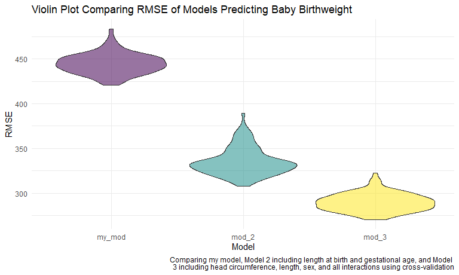

P8105 Homework 6 - Linear Models
================
Sydney Ng
due December 9, 2020 at 10:00 PM ET

## Problem 1

``` r
homicide_df <-
  read_csv("./homicide-data.csv") %>%
  mutate(
    victim_age = as.numeric(victim_age),
    city_state = str_c(city, state, sep = "_"),
    resolved = case_when(
      disposition == "Closed without arrest" ~ 0,
      disposition == "Open/No arrest"        ~ 0,
      disposition == "Closed by arrest"      ~ 1
    )
  ) %>%
  filter(city_state != "Tulsa_AL",
         victim_race %in% c("Black", "White")) %>%
  select(city_state, resolved, victim_age, victim_race, victim_sex)

# by default, R will remove missing values (the whole row) when we want
# to run a regression model, unless we make it some unknown category...
```

Starting with one city

``` r
baltimore_df <-
  homicide_df %>%
  filter(city_state == "Baltimore_MD")

glm(resolved ~ victim_age + victim_race + victim_sex,
    data = baltimore_df,
    family = binomial()) %>%
  broom::tidy() %>%
  mutate(
    OR = exp(estimate),
    CI_lower = exp(estimate - 1.96*std.error),
    CI_upper = exp(estimate + 1.96*std.error)
  ) %>%
  select(term, OR, starts_with("CI")) %>%
  knitr::kable(digits = 3)
```

| term              |    OR | CI\_lower | CI\_upper |
| :---------------- | ----: | --------: | --------: |
| (Intercept)       | 1.363 |     0.975 |     1.907 |
| victim\_age       | 0.993 |     0.987 |     1.000 |
| victim\_raceWhite | 2.320 |     1.648 |     3.268 |
| victim\_sexMale   | 0.426 |     0.325 |     0.558 |

Try this across different cities

``` r
model_results_df <-
  homicide_df %>% 
  nest(data = -city_state) %>% # 3 cities do not report race and won't be included
  mutate(
    models = map(.x = data, 
                 ~glm(resolved ~ victim_age + victim_race + victim_sex,
                     data = .x,
                     family = binomial())),
    results = map(models, broom::tidy)
  ) %>%
  select(city_state, results) %>%
  unnest(results) %>%
  mutate(
    OR = exp(estimate),
    CI_lower = exp(estimate - 1.96*std.error),
    CI_upper = exp(estimate + 1.96*std.error)
  ) %>%
  select(term, OR, starts_with("CI"))
```

``` r
model_results_df %>%
  filter(term == "victim_sexMale") %>%
  mutate(city_state = fct_reorder(city_state, OR)) %>%
  ggplot(aes(x=city_state, y=OR)) +
  geom_point() +
  geom_errorbar(aes(ymin = CI_lower, ymax = CI_upper)) +
  theme(axis.text.x = element_text(angle = 90, hjust = 1))
```


## Problem 2

In my linear regression model, we are using

  - `fincome` and `mrace` because SES and race are common confounders in
    epidemiological studies. Since mother’s race is categorical, dummy
    variables are created in the regression and “White” is treated as
    the reference category.
  - `catbmi` because previous studies show that underweight and obese
    mothers significantly influence baby birthweight; I made `ppbmi`
    into a categorical variable using the standard cut-offs for
    underweight and obese categories. Normal/overweight is treated as a
    single reference category.
  - `gaweeks` because how far along into the pregnancy (e.g., premature
    births) can influence baby birthweight.
  - `malform` because it is defined as the presence of malformations
    that could affect weight.
  - and `momage` because higher age is associated with risk of lower
    birthweight.

I decided not to include variables `ppwt` and `mheight` because both
weight and height get factored into BMI. I also debated including
`parity` since nulliparous women are more likely to have lower
birthweight babies, but also decided against this because it could be
correlated with age (i.e., the older the woman is, the more likely she
will not be nulliparous especially if she appears in this specific
dataset).

``` r
birthweight_df <-
  read_csv("./birthweight.csv") %>%
  mutate(
    babysex = if_else(babysex == 1, "Male", "Female"), # no missing values
    mrace = case_when(mrace == 1 ~ "White", mrace == 2 ~ "Black",
                      mrace == 3 ~ "Asian", mrace == 4 ~ "Puerto Rican",
                      mrace == 8 ~ "Other"),
    frace = case_when(frace == 1 ~ "White", frace == 2 ~ "Black",
                      frace == 3 ~ "Asian", frace == 4 ~ "Puerto Rican",
                      frace == 8 ~ "Other", frace == 9 ~ "Unknown"),
    malform = if_else(malform == 1, "Present", "Absent"),
    mrace = as.factor(mrace),
    mrace = relevel(mrace, ref = "White"),
    catbmi = case_when(ppbmi < 18.5 ~ "Underweight",
                       ppbmi > 30 ~ "Obese",
                       ppbmi <= 30 & ppbmi >= 18.5 ~ "Normal/Overweight"),
    catbmi = as.factor(catbmi),
    catbmi = relevel(catbmi, ref = "Normal/Overweight")
  ) %>%
  select(-ppbmi)

my_model <- glm(bwt ~ 
                  fincome + mrace + catbmi + momage + gaweeks + malform + smoken,
    data = birthweight_df,
    family = gaussian) 

my_model %>%
  broom::tidy() %>%
  mutate(
    CI_lower = estimate - 1.96*std.error,
    CI_upper = estimate + 1.96*std.error
  ) %>%
  select(term, estimate, starts_with("CI")) %>%
  knitr::kable(digits = 3)
```

| term              |  estimate | CI\_lower | CI\_upper |
| :---------------- | --------: | --------: | --------: |
| (Intercept)       |   936.507 |   750.039 |  1122.975 |
| fincome           |     0.415 |   \-0.154 |     0.983 |
| mraceAsian        | \-123.653 | \-260.383 |    13.077 |
| mraceBlack        | \-274.440 | \-306.449 | \-242.430 |
| mracePuerto Rican | \-184.433 | \-244.772 | \-124.094 |
| catbmiObese       |   112.584 |    24.218 |   200.951 |
| catbmiUnderweight | \-112.528 | \-154.654 |  \-70.402 |
| momage            |     0.529 |   \-3.248 |     4.306 |
| gaweeks           |    59.243 |    54.974 |    63.511 |
| malformPresent    |     3.911 | \-221.338 |   229.160 |
| smoken            |  \-10.721 |  \-12.570 |   \-8.872 |

Adding predictions and residuals

``` r
my_pred <- add_predictions(birthweight_df, my_model) %>%
  add_residuals(my_model) %>%
  select(fincome, mrace, catbmi, momage, gaweeks, malform, smoken, pred, resid)

my_pred %>%
  ggplot(aes(x = pred, y = resid)) +
  geom_point(alpha = 0.5) +
  labs(
    title = "Residuals vs Predicted Values",
    x = "Predicted Birthweight (grams)",
    y = "Residual",
    caption = "A plot of model residuals against fitted values of baby birthweights including \nfamily income, mother race, BMI, age, gestational age, malformatons, and smoking.")
```


#### Model 2: Model including length at birth and gestational age

``` r
model2 <- glm(bwt ~ blength + gaweeks,
    data = birthweight_df,
    family = gaussian) 

model2 %>%
  broom::tidy() %>%
  mutate(
    CI_lower = estimate - 1.96*std.error,
    CI_upper = estimate + 1.96*std.error
  ) %>%
  select(term, estimate, starts_with("CI")) %>%
  knitr::kable(digits = 3)
```

| term        |   estimate |  CI\_lower |  CI\_upper |
| :---------- | ---------: | ---------: | ---------: |
| (Intercept) | \-4347.667 | \-4539.665 | \-4155.669 |
| blength     |    128.556 |    124.656 |    132.456 |
| gaweeks     |     27.047 |     23.680 |     30.414 |

#### Model 3: Modeling including head circumference, length, sex, and all interactions (including the three-way interaction)

``` r
model3 <- glm(bwt ~ bhead*blength*babysex,
    data = birthweight_df,
    family = gaussian) 

model3 %>%
  broom::tidy() %>%
  mutate(
    CI_lower = estimate - 1.96*std.error,
    CI_upper = estimate + 1.96*std.error
  ) %>%
  select(term, estimate, starts_with("CI")) %>%
  knitr::kable(digits = 3)
```

| term                      |   estimate |  CI\_lower |  CI\_upper |
| :------------------------ | ---------: | ---------: | ---------: |
| (Intercept)               |  \-801.949 | \-2962.472 |   1358.574 |
| bhead                     |   \-16.598 |   \-83.417 |     50.222 |
| blength                   |   \-21.646 |   \-67.455 |     24.163 |
| babysexMale               | \-6374.868 | \-9663.292 | \-3086.445 |
| bhead:blength             |      3.324 |      1.928 |      4.721 |
| bhead:babysexMale         |    198.393 |     98.253 |    298.533 |
| blength:babysexMale       |    123.773 |     54.941 |    192.605 |
| bhead:blength:babysexMale |    \-3.878 |    \-5.949 |    \-1.807 |

#### Comparing models using Cross-Validation

``` r
# splitting training and testing data by 80%/20%
train_df = sample_frac(birthweight_df, .80)
test_df = anti_join(birthweight_df, train_df)

crossval_df <- crossv_mc(birthweight_df, 100) %>%
  mutate(
    train = map(train, as_tibble),
    test = map(test, as_tibble))

crossval_df <-
  crossval_df %>%
    mutate(
      my_mod = map(train, 
                   ~glm(bwt ~ fincome + mrace + catbmi + momage + gaweeks +
                          malform + smoken, family = gaussian, data = .x)),
      mod_2 = map(train, ~glm(bwt ~ blength + gaweeks, family = gaussian, 
                              data = .x)),
      mod_3 = map(train, ~glm(bwt ~ bhead*blength*babysex, family = gaussian,
                              data = .x)))%>% 
    mutate(
      rmse_my_mod = map2_dbl(my_mod, test, ~rmse(model = .x, data = .y)),
      rmse_mod_2 = map2_dbl(mod_2, test, ~rmse(model = .x, data = .y)),
      rmse_mod_3 = map2_dbl(mod_3, test, ~rmse(model = .x, data = .y))) %>% 
  select(starts_with("rmse")) %>% 
  pivot_longer(
    everything(),
    names_to = "model", 
    values_to = "rmse",
    names_prefix = "rmse_") %>% 
  mutate(model = fct_inorder(model))

crossval_df %>% 
  ggplot(aes(x = model, y = rmse)) +
  geom_violin(aes(fill = model, alpha = 0.5)) +
  theme(legend.position = "none") +
  labs(
    title = "Violin Plot Comparing RMSE of Models Predicting Baby Birthweight",
    x = "Model",
    y = "RMSE",
    caption = "Comparing my model, Model 2 including length at birth and gestational age, and Model \n3 including head circumference, length, sex, and all interactions using cross-validation")
```



Using the root-mean squared error (RSME) to compare the three models, it
turns out that my model is actually pretty bad at predicting baby
birthweights using the all the variables I included. Model 3 including
baby head circumference, length, sex, and all interactions is the best
model for prediction, whereas Model 2 including length at birth and
gestational age is a close second.

## More about problem 3

``` r
weather_df = 
  rnoaa::meteo_pull_monitors(
    c("USW00094728"),
    var = c("PRCP", "TMIN", "TMAX"), 
    date_min = "2017-01-01",
    date_max = "2017-12-31") %>%
  mutate(
    name = recode(id, USW00094728 = "CentralPark_NY"),
    tmin = tmin / 10,
    tmax = tmax / 10) %>%
  select(name, id, everything())
```

    ## Registered S3 method overwritten by 'hoardr':
    ##   method           from
    ##   print.cache_info httr

    ## using cached file: C:\Users\mailt\AppData\Local\Cache/R/noaa_ghcnd/USW00094728.dly

    ## date created (size, mb): 2020-12-07 15:24:56 (7.552)

    ## file min/max dates: 1869-01-01 / 2020-12-31

``` r
boot_sample = function(df) {
  sample_frac(df, replace = TRUE)
}

n_samples = 5000
boot_straps = tibble(
  strap_number = 1:n_samples,
  strap_sample = rerun(n_samples, boot_sample(weather_df))
  )
```

A simple linear regression with `tmax` as the outcome and `tmin` as the
predictor.

``` r
bootstrap_results <-
  boot_straps %>%
  mutate(
    models = map(strap_sample, ~lm(tmax ~ tmin, data = .x)),
    results = map(models, broom::tidy())
  ) %>%
  select(-strap_sample, -models) %>%
  unnest(results)
```

``` r
# central park weather dataset, getting rid of Waiki and Wtaerhole
# max temp and min temp scatterplot, we are interested in the r^2

# log(beta0*beta1)
# fit a model using the data and compute the adjusted r^2 using broom::glance()
# then use broom::tidy() to get all the coefficients to be able to multiply them
# AFTER you get the process, use bootstrapping
```
